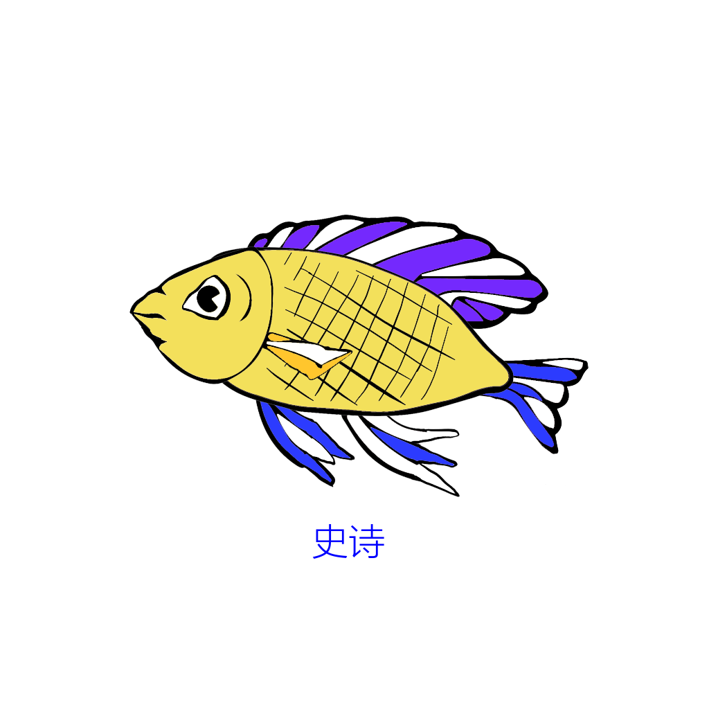
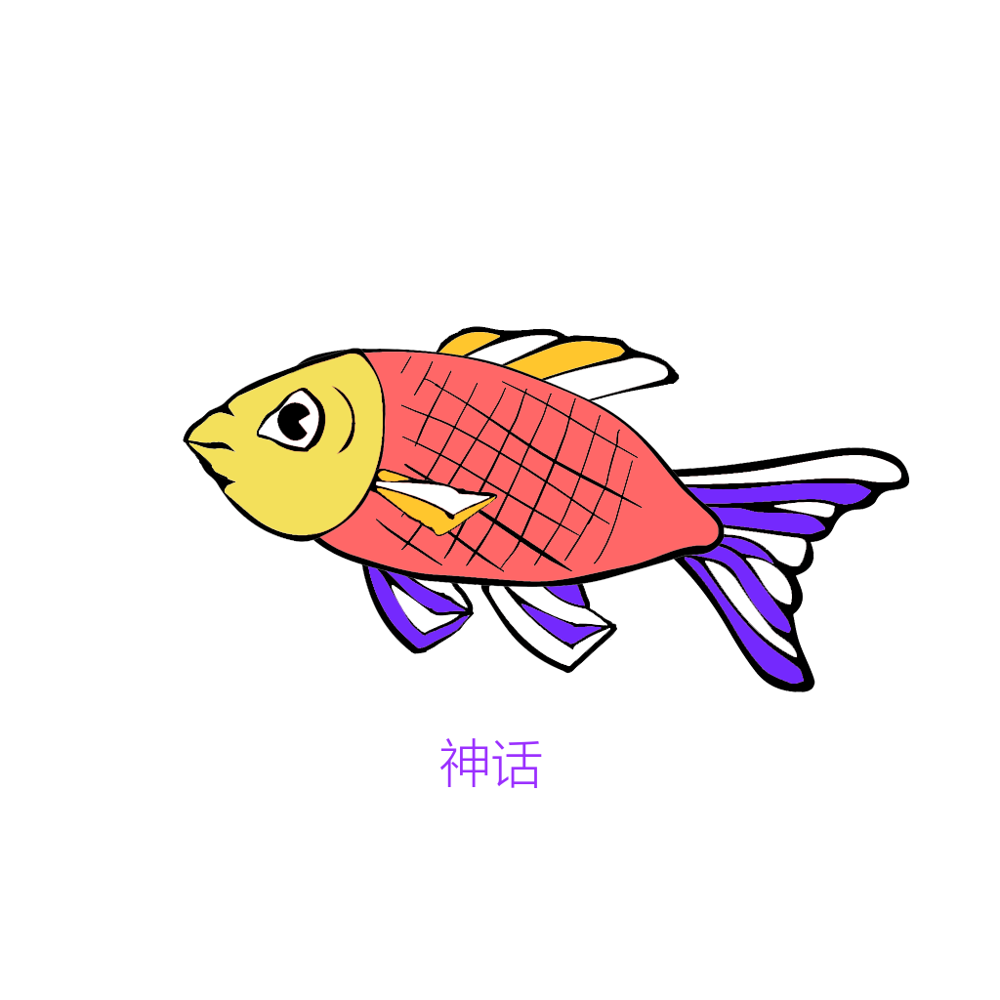

# Web3j-Android-Solidity-example

- This is more than a simple web3j project using solidity.
- What we are trying to acheive here is to make a dapp game just like [cryptokitties](cryptokitties.co) but on android which is supposed to be harder since you have to consider many things like wallet and user interface.

# Quick Overview

## SolidityAndWeb3js
- The folder  contains solidity contracts
    +  solidity source code which tells how a Fish( actually, i prefer to call it CryptoFancyCarp ) is made with pieces.
    + Also it is a genetic game which means you can let your fish to mate with others and have baby fish. This, i implemented a genetic algorithm for it. You can also see it here:[GeneticConsoleWithSolidity](https://github.com/zoeleesss/GeneticConsoleWithSolidity).
    + and other contract using soldity. I put many files together to FishContracts. 
- The folder  contains Web3js implementation
    + I already deployed the contract and made a simple web3js file for you to call the functions. I have deployed a webpage just for you. [FishDApp](http://myhomie.chinaxueyun.com/fishy/)

- Deployment 
    + When you deploy the contract, use this FishContracts file. And remember to deploy two contracts: `FishCore` & `GeneticConsole` and rememeber to set the address of geneticConsole to fishcore.

## PHPServerAPI
- The folder contains secret fomula of a fish's gene.
    + Gene Quality
        + There are several qualities about genes i created.
        + Start from normal to rare,superior,Godlike, and even to MasterOfUniverse.
        + `$names = ['普通','稀有','卓越','史诗','神话','传说','超神','宇宙之主'];`
        + Try it yourself here: [FishAlphaGene](http://myhomie.chinaxueyun.com/FishAlpha/rare.php?gene=211442484481842641746127486746148764827414142441241)

    + Image
        + There are nearly 200 million possibilities of the outlook of our fishes.
        + Here are some exaples: 
        + 
        + 
        + 
        + See more in images folder. Or Try the combination yourself here: [FishAlphaImage](http://myhomie.chinaxueyun.com/FishAlpha/index.php?gene=211442484481842641746127486746148764827414142441241)

## AndroidAndWeb3j
-  The  folder  contains android code & generated contract code
    + Wallet: How to use/create/import Ethereum wallet.
    + FishAPI: How to call,send transaction to a deployed contract
    + Utils: Some useful functions waiting to be explored
    + Others.

## Others
- This file includes everything that i need about my deplyed contract and how i can connect to blockchain. 
    + Infura. It has my own Infura API token. You are welcome to use it by any means.
    + Contract address, contract ABI, contract owner.
    + Web3j simple code to call or send transaction of functions of a contract. You can use them in the chrome console. I deployed my web3j front-end here. Try it out. [FishDApp](http://myhomie.chinaxueyun.com/fishy/)

# The processes of Making Your Own Android DAPP
    ##Soidity First
    1. You need to write your own solidity source code.
    2. Compile and Deploy your source code using `remix`
    (Don't forget to record your contract address! )
    ##Autogenerate file 
    3. Now use your source code( contract.sol )to use `solc` and `web3j` command tool to generate a java file.
    ##Android
    ###dependencies
    4. Add `compile ('org.web3j:core:3.3.1-android')` to app/build.gradle
    ###Testing
    5. Write and run simple code like creating a wallet
    ##Done

Tools:
    
[remix](https://ethereum.github.io/browser-solidity/#optimize=false&version=soljson-v0.4.24+commit.e67f0147.js)

solc (Remeber to use `npm install solc` to get solc): 

Example: `solc MetaCoin.sol --bin --abi --optimize -o /Users/pro/Desktop`

Format: `solc <contract>.sol --bin --abi --optimize -o <output-dir>/`

web3j:

Format: `web3j solidity generate [--javaTypes|--solidityTypes] /path/to/<smart-contract>.bin /path/to/<smart-contract>.abi -o /path/to/src/main/java -p com.your.organisation.name`

# Erros during Android development
### This is a list a possible error you might encounter, and i may have dealt with them already. So I am gonna share my experience here.

- `Error: Execution failed for task ': app: packageAllDebugClassesForMultiDex'. > Java.util.zip.ZipException: duplicate entry: bolts / AggregateException.class`
- Solution: 
1.add `multiDexEnabled true  ` to defaultConfig in app/build.gradle. 2.add `compile 'com.android.support:multidex:1.0.3'` to dependecies in app/build.gradle.

- `java.lang.OutOfMemoryError: Failed to allocate a 268435468 byte allocation with 8050708 free bytes and 244MB until OOM` 
- Solution: 
1. When you are trying to create a new wallet.
Try `String filename = WalletUtils.generateLightNewWalletFile(password,new File(filepath));` 👍
instead of `String filename = WalletUtils.generateFullNewWalletFile(password,new File(filepath));` 
2. And when you import an old wallet from ECKeyPair,
Try `String filename = WalletUtils.generateWalletFile(password,ecKeyPair,new File(filepath),false);`👍
instead of `String filename = WalletUtils.generateWalletFile(password,ecKeyPair,new File(filepath),true);` 

- `javax.net.ssl.SSLException: Connection closed by peer` 
- Solution: Try using higher version of Android devices. I tried Android 7.0 on Genymotion and it works well. See more about this issue here: [ERROR with infura & web3j on Android 4.x : javax.net.ssl.SSLException: Connection closed by peer](https://github.com/web3j/web3j/issues/583)

# Contributors - Join us by pulling requests:

<h2> Zoe Lee </h2>
<h3> Jingyuan Ni </h3>
<h3> Dongqi Shen </h3>

# Donate here:

## Github : ❤❤❤ Stars ❤❤❤ 

Ethereum : `0x94cba7B70800575a3A4BfFd3B195bE4CcF5f7AAd`
    

